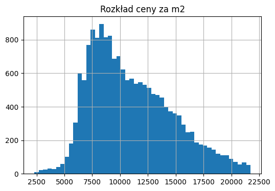
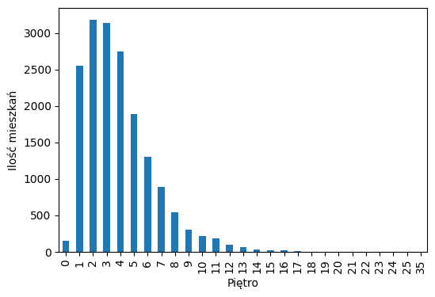
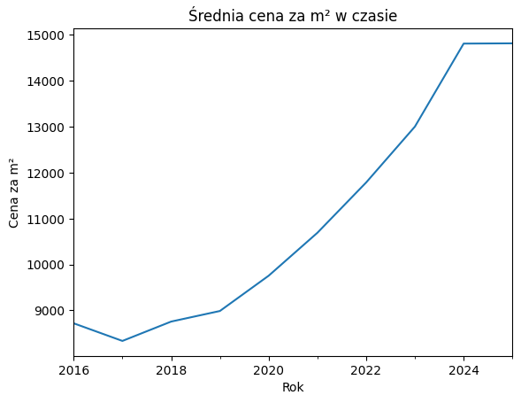
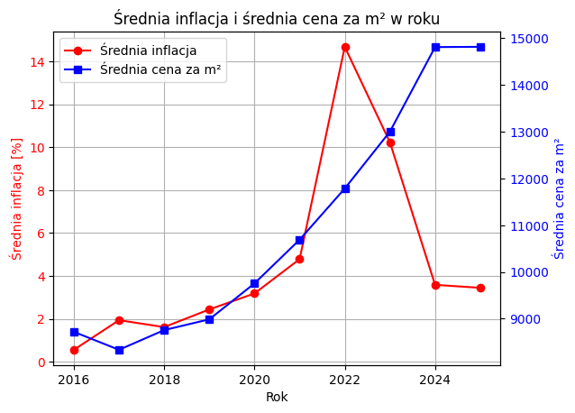

# Eksploracja Rejestru Cen Nieruchomości — Warszawa 🏠📊

Repozytorium zawiera analizę i modelowanie cen transakcyjnych mieszkań w Warszawie w okresie 2016–2025. Dane pochodzą z publicznego Rejestru Cen Nieruchomości (RCN) oraz danych inflacyjnych GUS.

---

## 📁 Struktura projektu

```
RCN/
├── data/
│   ├── data_processed.csv        # Przetworzone dane gotowe do modelowania
│   ├── inflacja.csv              # Surowe dane inflacyjne
│   ├── inflacja_prepared.csv     # Przekształcone dane inflacyjne
│   ├── sales_random.csv          # Dane transakcyjne (próbka)
├── models/
│   ├── model_linear_regression.pkl
│   ├── model_random_forest.pkl
│   └── model_xgboost.pkl
├── inflacja.ipynb                # Eksploracja i analiza danych inflacyjnych
├── rcn.ipynb                     # Eksploracja danych transakcyjnych
├── train_models.py               # Skrypt trenujący modele
└── test_models.py                # Skrypt testujący i porównujący modele
```

---

## 🔍 Analiza

Dane zawierają transakcje sprzedaży mieszkań w Warszawie z informacjami o cenie, metrażu, liczbie pokoi, piętrze i lokalizacji. W ramach eksploracji zbadano m.in. rozkład cen za m². Rozkład jest prawostronnie skośny — większość mieszkań sprzedawana jest w przedziale 7 000–10 000 zł/m², przy medianie 10 298 zł/m² i średniej 11 001 zł/m². Szeroki rozstęp cen (2 500–22 500 zł/m²) wynika z różnych lat transakcji w zbiorze. Starsze transakcje z lat 2016–2020 znacząco zaniżają rozkład.




W zbiorze danych dominują mieszkania znajdujące się na piętrach 2–4, które stanowią największą część transakcji. Wraz ze wzrostem numeru piętra liczba transakcji maleje — mieszkania powyżej 8. piętra są w zbiorze słabo reprezentowane.



Dane potwierdzają silny trend wzrostowy cen — średnia cena za m² wzrosła z ~7 900 zł w 2017 roku do ~15 900 zł w 2024, co oznacza niemal podwojenie cen w ciągu 7 lat.



Analiza inflacji i cen transakcyjnych wskazuje na opóźnioną reakcję rynku — szczyt inflacji przypadł na 2022 rok, natomiast ceny mieszkań osiągnęły maksimum rok później i utrzymują się na poziomie ~15 000 zł/m² mimo wyraźnego spadku inflacji. Sugeruje to że wzrost cen nieruchomości jest napędzany nie tylko inflacją, ale również innymi czynnikami



---

## 🤖 Modele

Porównano trzy modele regresji przewidujące cenę transakcyjną mieszkania:
 
| Model | Train RMSE | Train R² | Test RMSE | Test R² |
| --- | --- | --- | --- | --- |
| Linear Regression | 55 096 | 0.9424 | 56 158 | 0.9398 |
| Random Forest | 1 669 | 0.9999 | 4 544 | 0.9996 |
| XGBoost | 4 686 | 0.9996 | 7 372 | 0.9990 |

Random Forest i XGBoost wykazują niewielkie oznaki przeuczenia. Kolejnym krokiem jest dalsza regularyzacja modeli.

---

## 🛠️ Technologie

Python, Pandas, Scikit-learn, XGBoost, Matplotlib, Seaborn
