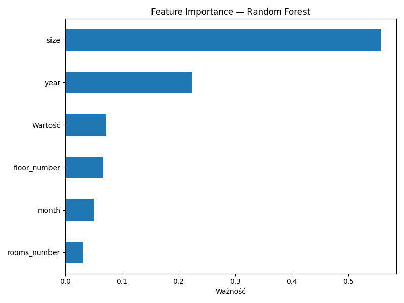

# Eksploracja Rejestru Cen Nieruchomości — Warszawa 🏠📊

Repozytorium zawiera analizę i modelowanie cen transakcyjnych mieszkań w Warszawie w okresie 2016–2025. Dane pochodzą z publicznego Rejestru Cen Nieruchomości (RCN) oraz danych inflacyjnych GUS.

---

## 📁 Struktura projektu

```
RCN/
├── data/
│   ├── data_processed.csv            # Przetworzone dane gotowe do modelowania
│   ├── inflacja.csv                  # Surowe dane inflacyjne
│   ├── inflacja_prepared.csv         # Przekształcone dane inflacyjne
│   └── sales_random.csv              # Dane transakcyjne (próbka)
├── eda/
│    ├── inflacja.ipynb               # Eksploracja i analiza danych inflacyjnych
│    └── rcn.ipynb                    # Eksploracja danych transakcyjnych
├── images/                           # Obrazy
├── train-test/
│    ├── train_models.py              # Skrypt trenujący modele
│    ├── test_models.py               # Skrypt testujący i porównujący modele
│    └── train_models_improve.py      # Skrypt trenujący modele z poprawionymi parametrami
└── requirements.txt

```

---

## 🔍 Analiza

Dane zawierają transakcje sprzedaży mieszkań w Warszawie z informacjami o cenie, metrażu, liczbie pokoi, piętrze i lokalizacji. W ramach eksploracji zbadano m.in. rozkład cen za m². Rozkład jest prawostronnie skośny — większość mieszkań sprzedawana jest w przedziale 7 000–10 000 zł/m², przy medianie 10 298 zł/m² i średniej 11 001 zł/m². Szeroki rozstęp cen (2 500–22 500 zł/m²) wynika z różnych lat transakcji w zbiorze. Starsze transakcje z lat 2016–2020 znacząco zaniżają rozkład.


W zbiorze danych dominują mieszkania znajdujące się na piętrach 2–4, które stanowią największą część transakcji. Wraz ze wzrostem numeru piętra liczba transakcji maleje — mieszkania powyżej 8. piętra są w zbiorze słabo reprezentowane.


Dane potwierdzają silny trend wzrostowy cen — średnia cena za m² wzrosła z ~7 900 zł w 2017 roku do ~15 900 zł w 2024, co oznacza niemal podwojenie cen w ciągu 7 lat.


Analiza inflacji i cen transakcyjnych wskazuje na opóźnioną reakcję rynku — szczyt inflacji przypadł na 2022 rok, natomiast ceny mieszkań osiągnęły maksimum rok później i utrzymują się na poziomie ~15 000 zł/m² mimo wyraźnego spadku inflacji. Sugeruje to że wzrost cen nieruchomości jest napędzany nie tylko inflacją, ale również innymi czynnikami


---

## 🤖 Modele

Porównano trzy modele regresji przewidujące cenę transakcyjną mieszkania:


Ważność cech wg Random Forest



---
 
| Model             | Train RMSE | Train R² | Test RMSE  | Test R²  |
|-------------------|------------|----------|------------|----------|
| Linear Regression | 146 090    | 0.5951   | 146 319    | 0.5911   |
| Random Forest     |  55 048    | 0.9425   | 144 874    | 0.5991   |
| XGBoost           | 109 275    | 0.7735   | 141 543    | 0.6173   |

Random Forest wykazuje oznaki przeuczenia (Train R² 0.94 vs Test R² 0.60). Kolejnym krokiem jest regularyzacja modeli.


## 🔧 Udoskonalenie modeli

W pierwszej fazie projektu zastosowano modele bazowe z domyślnymi parametrami. Następnie przeprowadzono strojenie hiperparametrów w celu poprawy jakości predykcji.
W efekcie uzyskano lepszą generalizację modeli, szczególnie w przypadku algorytmów Random Forest i XGBoost, poprzez redukcję przeuczenia.


| Model             | Train RMSE | Train R² | Test RMSE  | Test R²  |
|-------------------|------------|----------|------------|----------|
| Linear Regression | 146 090    | 0.5951   | 146 319    | 0.5911   |
| Random Forest     | 121 586    | 0.7195   | 139 635    | 0.6276   |
| XGBoost           | 134 222    | 0.6582   | 138 528    | 0.6335   |


Kolejnym krokiem jest wzbogacenie danych nowe cechy.

---

## 🛠️ Technologie

Python, Pandas, Scikit-learn, XGBoost, Matplotlib, Seaborn
Python: 3.11.9
